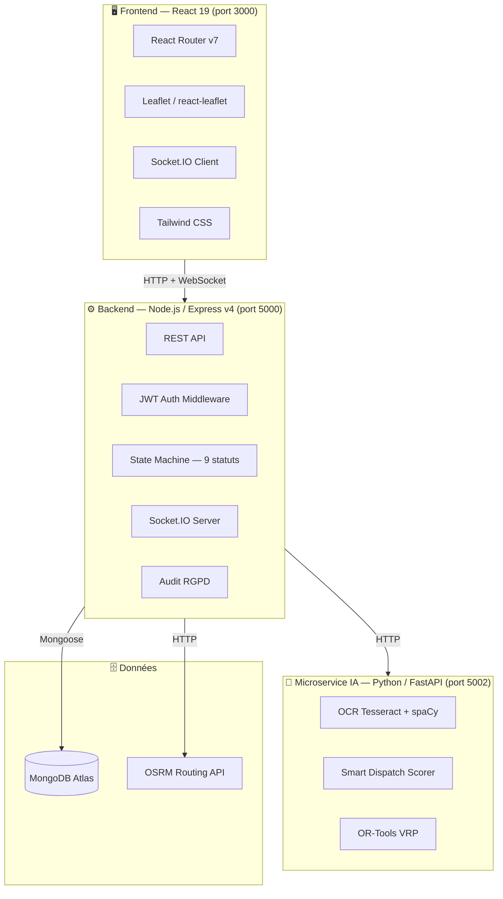

# 🚑 BlancBleu — Plateforme de Transport Sanitaire Non Urgent

<div align="center">


**Système de gestion intelligent des transports sanitaires non urgents**
**Ambulances Blanc Bleu — Nice, Alpes-Maritimes (06)**

</div>

---

## 📋 Table des matières

1. [Description du projet](#-description-du-projet)
2. [Aperçu de l'interface](#-aperçu-de-linterface)
3. [Architecture technique](#-architecture-technique)
4. [Prérequis](#-prérequis)
5. [Installation](#-installation-complète)
6. [Lancement des services](#-lancement-des-services)
7. [Variables d'environnement](#-variables-denvironnement)
8. [Structure du projet](#-structure-du-projet)
9. [API Reference](#-api-reference)
10. [Tests](#-tests)
11. [CI/CD](#-cicd-github-actions)
12. [Fonctionnalités principales](#-fonctionnalités-principales)
13. [Sécurité & RGPD](#-sécurité--rgpd)
14. [Auteur & Licence](#-auteur--licence)

---

## 🎯 Description du projet

**BlancBleu** est une application web complète de gestion de transport sanitaire **non urgent** développée pour la société **Ambulances Blanc Bleu** de Nice.

Elle couvre l'ensemble du cycle de vie d'un transport — de la demande initiale jusqu'à la facturation — en intégrant un **microservice d'intelligence artificielle local** pour automatiser les tâches chronophages du dispatcher.

### 🏥 Périmètre métier

| Type de patient | Transport |
|---|---|
| Patients dialysés (séances récurrentes) | VSL, TPMR |
| Chimiothérapie / Radiothérapie | VSL, AMBULANCE |
| Personnes âgées / PMR | TPMR |
| Consultations, hospitalisations, retours | VSL, AMBULANCE |

> ⚠️ Ce système gère exclusivement le transport **non urgent**. Il n'y a pas de logique SAMU, SMUR, ni de priorités P1/P2/P3.

---

## 🖥️ Aperçu de l'interface

```
┌─────────────────────────────────────────────────────────────────┐
│  🚑 BlancBleu                       [Dispatcher] Jean Dupont ▾  │
├──────────┬──────────────────────────────────────────────────────┤
│          │  📊 Dashboard            Aujourd'hui : 12 transports  │
│ ▸ Tableau│  ┌──────────┐ ┌──────────┐ ┌──────────┐ ┌─────────┐ │
│   de bord│  │ PLANIFIÉS │ │ EN COURS │ │COMPLÉTÉS │ │ANNULÉS  │ │
│          │  │    5      │ │    4     │ │    2     │ │   1     │ │
│ ▸ Trans- │  └──────────┘ └──────────┘ └──────────┘ └─────────┘ │
│   ports  │                                                       │
│          │  🗺️ Carte temps réel (Leaflet)                        │
│ ▸ Flotte │  ┌─────────────────────────────────────────────────┐ │
│          │  │  🚐 VSL-03 ──────────►  🏥 Hôpital Pasteur     │ │
│ ▸ IA     │  │  🚑 AMB-01        🏠 Patient — 43.71, 7.26     │ │
│          │  └─────────────────────────────────────────────────┘ │
│ ▸ Audit  │                                                       │
└──────────┴──────────────────────────────────────────────────────┘
```

---

## 🏗️ Architecture technique



### 🔄 Machine d'état transport (9 statuts)

```
                    ┌─────────────┐
                    │  REQUESTED  │ ← Nouvelle demande
                    └──────┬──────┘
                           │ confirm
                    ┌──────▼──────┐
                    │  CONFIRMED  │ ← Vérifiée
                    └──────┬──────┘
                           │ schedule
                    ┌──────▼──────┐
                    │  SCHEDULED  │ ← Planifiée
                    └──────┬──────┘
                           │ assign
                    ┌──────▼──────┐
                    │  ASSIGNED   │ ← Véhicule + chauffeur affectés
                    └──────┬──────┘
                           │ en-route
              ┌────────────▼────────────┐
              │  EN_ROUTE_TO_PICKUP     │
              └────────────┬────────────┘
                           │ arrived
              ┌────────────▼────────────┐
              │  ARRIVED_AT_PICKUP      │──── no-show ──→ NO_SHOW
              └────────────┬────────────┘
                           │ on-board
              ┌────────────▼────────────┐
              │  PATIENT_ON_BOARD       │
              └────────────┬────────────┘
                           │ destination
         ┌─────────────────▼─────────────────┐
         │      ARRIVED_AT_DESTINATION        │
         └─────────────────┬─────────────────┘
                           │ complete
                    ┌──────▼──────┐
                    │  COMPLETED  │ ✅
                    └─────────────┘

   CANCELLED ← depuis tout statut avant EN_ROUTE
```

---

## ✅ Prérequis

| Outil | Version minimale | Rôle |
|---|---|---|
| [Node.js](https://nodejs.org/) | **20 LTS** | Backend + Frontend |
| [Python](https://python.org/) | **3.11** | Microservice IA |
| [MongoDB](https://www.mongodb.com/atlas) | **7.0+** | Base de données (Atlas ou local) |
| [Tesseract OCR](https://github.com/UB-Mannheim/tesseract/wiki) | **5.3+** | Extraction PMT (optionnel) |
| [Poppler](https://github.com/oschwartz10612/poppler-windows/releases) | **24.x** | Conversion PDF→image (optionnel) |
| Git | **2.x** | Clonage du repo |

> 💡 **Tesseract et Poppler sont optionnels** : le service démarre sans eux, mais le module OCR sera désactivé (`pmt_ocr: false` dans `/health`).

---

## 🚀 Installation complète

### 1️⃣ Cloner le dépôt

```bash
git clone https://github.com/Mouinbhm/blancbleu.git
cd blancbleu
```

### 2️⃣ Configurer les variables d'environnement

```bash
cp .env.example .env
```

Éditer `.env` avec vos valeurs (voir section [Variables d'environnement](#-variables-denvironnement)).

### 3️⃣ Installer le Backend Node.js

```bash
cd server
npm ci
```

Créer le premier compte administrateur :

```bash
npm run create-admin
```

### 4️⃣ Installer le Frontend React

```bash
cd client
npm ci
```

### 5️⃣ Installer le Microservice IA Python

```bash
cd ai-service

# Créer et activer un environnement virtuel
python -m venv venv

# Windows
venv\Scripts\activate

# Linux / macOS
source venv/bin/activate

# Installer les dépendances
pip install -r requirements.txt

# Télécharger le modèle NLP français (spaCy)
python -m spacy download fr_core_news_sm
```

#### 🪟 Windows — configurer Tesseract & Poppler

1. Télécharger et installer [Tesseract OCR](https://github.com/UB-Mannheim/tesseract/wiki) dans `C:\Program Files\Tesseract-OCR\`
2. Télécharger [Poppler pour Windows](https://github.com/oschwartz10612/poppler-windows/releases) et ajouter `poppler/bin/` au `PATH`
3. Redémarrer le terminal

---

## ▶️ Lancement des services

Ouvrir **3 terminaux** distincts :

### Terminal 1 — Backend Node.js

```bash
cd server
npm run dev
# ✅ BlancBleu Transport démarré sur http://localhost:5000
# ✅ Swagger  : http://localhost:5000/api-docs
```

### Terminal 2 — Microservice IA Python

```bash
cd ai-service
venv\Scripts\activate        # Windows
# source venv/bin/activate   # Linux/macOS

uvicorn main:app --host 0.0.0.0 --port 5002 --reload
# ✅ BlancBleu AI Service sur http://localhost:5002
# ✅ Swagger  : http://localhost:5002/docs
```

### Terminal 3 — Frontend React

```bash
cd client
npm start
# ✅ Interface sur http://localhost:3000
```

### 🐳 Alternative — Docker Compose

```bash
docker-compose up --build
```

---

## 🔐 Variables d'environnement

Copier `.env.example` → `.env` et renseigner :

```env
# ── MongoDB ──────────────────────────────────────────────────────
MONGO_URI=mongodb+srv://<user>:<password>@cluster.mongodb.net/blancbleu

# ── JWT ─────────────────────────────────────────────────────────
# Générer : node -e "console.log(require('crypto').randomBytes(64).toString('hex'))"
JWT_SECRET=CHANGE_ME_GENERATE_A_STRONG_64_CHAR_SECRET

# ── Serveur ──────────────────────────────────────────────────────
PORT=5000
NODE_ENV=development

# ── CORS ─────────────────────────────────────────────────────────
CLIENT_URL=http://localhost:3000
ALLOWED_ORIGINS=http://localhost:3000

# ── Microservice IA ──────────────────────────────────────────────
AI_API_URL=http://localhost:5002

# ── OSRM Routing (calcul de distances) ───────────────────────────
OSRM_URL=https://router.project-osrm.org

# ── Email (notifications) ────────────────────────────────────────
EMAIL_HOST=smtp.gmail.com
EMAIL_PORT=587
EMAIL_USER=votre-email@gmail.com
EMAIL_PASS=votre-app-password-gmail
EMAIL_FROM=BlancBleu <noreply@blancbleu.fr>

# ── Alertes superviseurs ─────────────────────────────────────────
SUPERVISEUR_EMAILS=superviseur@blancbleu.fr,admin@blancbleu.fr

# ── Premier admin ────────────────────────────────────────────────
ADMIN_EMAIL=admin@blancbleu.fr
ADMIN_PASSWORD=CHANGE_ME_STRONG_PASSWORD
ADMIN_NOM=Admin
ADMIN_PRENOM=BlancBleu
```

---

## 📁 Structure du projet

```
blancbleu/
├── 📂 server/                          # Backend Node.js v1.3.0
│   ├── Server.js                       # Point d'entrée Express
│   ├── controllers/
│   │   ├── transportController.js      # Cycle de vie des transports
│   │   ├── AuthController.js           # Authentification JWT
│   │   ├── aiController.js             # Proxy vers le microservice IA
│   │   ├── vehicleController.js        # Gestion de la flotte
│   │   ├── personnelController.js
│   │   ├── factureController.js
│   │   └── analyticsController.js
│   ├── models/
│   │   ├── Transport.js                # Entité principale (9 statuts)
│   │   ├── Vehicle.js                  # VSL / TPMR / AMBULANCE
│   │   ├── User.js                     # Dispatcher / Superviseur / Admin
│   │   ├── Personnel.js
│   │   ├── Facture.js
│   │   └── AuditLog.js                 # Audit RGPD (TTL 90 jours)
│   ├── routes/
│   │   ├── transports.js               # /api/transports (+ transitions)
│   │   ├── auth.js                     # /api/auth
│   │   ├── vehicles.js                 # /api/vehicles
│   │   ├── ai.js                       # /api/ai
│   │   ├── planning.js                 # /api/planning
│   │   ├── analytics.js                # /api/analytics
│   │   └── audit.js                    # /api/audit
│   ├── services/
│   │   ├── transportStateMachine.js    # Machine d'état (transitions valides)
│   │   ├── transportLifecycle.js       # Orchestration des transitions
│   │   ├── socketService.js            # WebSocket temps réel
│   │   └── auditService.js             # Journalisation RGPD
│   ├── middleware/
│   │   ├── auth.js                     # Vérification JWT
│   │   ├── auditMiddleware.js          # Log automatique des requêtes
│   │   ├── rateLimiter.js              # Protection DDoS
│   │   └── sanitize.js                 # Protection NoSQL + XSS
│   ├── utils/
│   │   ├── geoUtils.js                 # Haversine + intégration OSRM
│   │   ├── healthCheck.js              # GET /api/health
│   │   └── logger.js                   # Winston
│   └── __tests__/
│       ├── unit/                       # Tests unitaires (machine d'état, geo)
│       └── integration/                # Tests intégration (auth, workflow)
│
├── 📂 client/                          # Frontend React 19
│   ├── src/
│   │   ├── components/                 # Composants réutilisables
│   │   ├── pages/                      # Vues principales
│   │   ├── services/                   # Appels API (axios)
│   │   └── hooks/                      # Custom hooks (Socket.IO, auth)
│   └── public/
│
├── 📂 ai-service/                      # Microservice IA Python v1.0.0
│   ├── main.py                         # Point d'entrée FastAPI (port 5002)
│   ├── routes/
│   │   ├── pmt.py                      # POST /pmt/extract, GET /pmt/status
│   │   ├── dispatch.py                 # POST /dispatch/recommend
│   │   └── routing.py                  # POST /routing/optimize
│   ├── services/
│   │   ├── pmt_extractor.py            # Tesseract OCR + regex + spaCy NER
│   │   ├── dispatch_scorer.py          # Scoring métier (0–100 pts)
│   │   └── route_optimizer.py          # Google OR-Tools VRP
│   ├── schemas/                        # Modèles Pydantic (validation)
│   │   ├── pmt_schemas.py
│   │   ├── dispatch_schemas.py
│   │   └── routing_schemas.py
│   ├── utils/
│   │   ├── ocr_utils.py                # Pipeline PDF → image → texte
│   │   └── regex_patterns.py           # Patterns regex PMT française
│   ├── tests/
│   │   └── test_ia.py                  # Tests pytest
│   ├── requirements.txt                # Dépendances complètes
│   └── requirements-ci.txt             # Dépendances CI (sans binaires système)
│
├── 📂 .github/
│   └── workflows/
│       └── ci.yml                      # Pipeline CI GitHub Actions
├── .env.example                        # Template variables d'environnement
└── docker-compose.yml
```

---

## 📡 API Reference

### 🔑 Authentification

| Méthode | Endpoint | Auth | Description |
|---|---|---|---|
| `POST` | `/api/auth/login` | ❌ | Connexion — retourne un JWT |
| `POST` | `/api/auth/register` | Admin | Créer un compte utilisateur |
| `GET` | `/api/auth/me` | ✅ | Profil de l'utilisateur connecté |

### 🚑 Transports

| Méthode | Endpoint | Description |
|---|---|---|
| `GET` | `/api/transports` | Liste avec filtres (statut, type, date) |
| `POST` | `/api/transports` | Créer une demande de transport |
| `GET` | `/api/transports/:id` | Détail d'un transport |
| `PATCH` | `/api/transports/:id/confirm` | REQUESTED → CONFIRMED |
| `PATCH` | `/api/transports/:id/schedule` | CONFIRMED → SCHEDULED |
| `PATCH` | `/api/transports/:id/assign` | SCHEDULED → ASSIGNED (véhicule + chauffeur) |
| `PATCH` | `/api/transports/:id/en-route` | ASSIGNED → EN_ROUTE_TO_PICKUP |
| `PATCH` | `/api/transports/:id/arrived` | → ARRIVED_AT_PICKUP |
| `PATCH` | `/api/transports/:id/on-board` | → PATIENT_ON_BOARD |
| `PATCH` | `/api/transports/:id/destination` | → ARRIVED_AT_DESTINATION |
| `PATCH` | `/api/transports/:id/complete` | → COMPLETED |
| `PATCH` | `/api/transports/:id/cancel` | → CANCELLED (body: `{ raison }`) |
| `PATCH` | `/api/transports/:id/no-show` | → NO_SHOW (body: `{ raison }`) |
| `GET` | `/api/transports/stats` | KPIs agrégés |

### 🤖 Microservice IA (FastAPI — port 5002)

| Méthode | Endpoint | Description |
|---|---|---|
| `GET` | `/health` | État du service et de ses modules |
| `POST` | `/pmt/extract` | Extraction OCR d'une PMT (PDF/image, max 10 Mo) |
| `GET` | `/pmt/status` | Disponibilité de Tesseract OCR |
| `POST` | `/dispatch/recommend` | Recommandation véhicule par scoring (0–100 pts) |
| `POST` | `/routing/optimize` | Optimisation de tournée OR-Tools VRP (max 100 transports) |

#### Exemple — `/health`

```json
{
  "status": "ok",
  "version": "1.0.0",
  "domaine": "transport sanitaire non urgent",
  "modules": {
    "pmt_ocr": true,
    "pmt_nlp": true,
    "routing": true,
    "dispatch": true
  }
}
```

#### Exemple — `/pmt/extract`

```bash
curl -X POST http://localhost:5002/pmt/extract \
  -F "pmt=@/chemin/vers/prescription.pdf" \
  -F "transportId=6789abc"
```

```json
{
  "extraction": {
    "patient": { "nom": "Martin", "prenom": "Jean", "dateNaissance": "1950-01-15" },
    "medecin": { "nom": "Dr. Dupont", "rpps": "12345678901" },
    "typeTransport": "VSL",
    "mobilite": "ASSIS",
    "destination": "Centre de dialyse Saint-Roch, Nice",
    "allerRetour": true
  },
  "confiance": 0.91,
  "validationRequise": false,
  "champsManquants": []
}
```

#### Exemple — `/dispatch/recommend`

```bash
curl -X POST http://localhost:5002/dispatch/recommend \
  -H "Content-Type: application/json" \
  -d '{
    "transport": { "_id": "t1", "mobilite": "ASSIS", "motif": "Dialyse" },
    "vehicules": [
      { "_id": "v1", "type": "VSL", "statut": "disponible",
        "position": { "lat": 43.71, "lng": 7.26 } }
    ],
    "chauffeurs": []
  }'
```

### 🗺️ Autres endpoints

| Méthode | Endpoint | Description |
|---|---|---|
| `GET` | `/api/health` | Santé du backend (MongoDB + IA + mémoire) |
| `GET` | `/api/vehicles` | Liste de la flotte |
| `GET` | `/api/analytics/dashboard` | KPIs dashboard |
| `GET` | `/api/audit` | Journal d'audit RGPD |
| `POST` | `/api/geo/distance` | Calcul de distance OSRM |

### ⚡ Événements WebSocket (Socket.IO)

| Événement | Direction | Déclencheur |
|---|---|---|
| `transport:created` | Serveur → Client | Nouveau transport créé |
| `transport:statut` | Serveur → Client | Changement de statut |
| `vehicule:assigne` | Serveur → Client | Véhicule affecté |
| `vehicule:position` | Serveur → Client | Mise à jour GPS |
| `dispatch:completed` | Serveur → Client | Dispatch automatique terminé |
| `pmt:extraite` | Serveur → Client | PMT extraite par IA |
| `stats:update` | Serveur → Client | KPIs mis à jour |

> 📖 **Documentation interactive** disponible sur `http://localhost:5000/api-docs` (Swagger UI) et `http://localhost:5002/docs` (FastAPI Swagger).

---

## 🧪 Tests

### Backend Node.js

```bash
cd server

# Tous les tests
npm test

# Tests unitaires uniquement (machine d'état, géoutils)
npm run test:unit

# Tests d'intégration uniquement (auth, workflow complet)
npm run test:integration

# Couverture de code
npm run test:coverage
```

Les tests d'intégration utilisent **MongoDB In-Memory** (`mongodb-memory-server`) — aucune base de données externe requise.

| Suite | Fichier | Couverture |
|---|---|---|
| Machine d'état | `__tests__/unit/stateMachine.test.js` | Transitions + guards |
| Géoutils | `__tests__/unit/geoUtils.test.js` | Haversine, OSRM |
| Auth routes | `__tests__/integration/auth.test.js` | Login, register, JWT |
| Workflow transport | `__tests__/integration/workflow.test.js` | Cycle de vie complet |

### Microservice IA Python

```bash
cd ai-service
source venv/bin/activate   # ou venv\Scripts\activate sur Windows

# Lancer les tests
pytest tests/test_ia.py -v --tb=short

# Avec couverture
pytest tests/test_ia.py -v --cov=. --cov-report=term-missing
```

---

## ⚙️ CI/CD GitHub Actions

Le pipeline CI `.github/workflows/ci.yml` comporte **4 jobs** exécutés en parallèle :

```
Push / PR sur main ou develop
         │
         ├── 🟢 Tests Backend (Node.js)
         │        npm run test:unit
         │        npm run test:integration  (MongoDB In-Memory)
         │
         ├── 🟢 Tests IA (Python / FastAPI)
         │        pytest tests/test_ia.py
         │
         ├── 🟢 Lint Frontend (React)
         │        npm run build
         │
         └── 🏁 CI Status  (badge README)
                  ✅ Tous verts → merge autorisé
```

### Variables CI (GitHub Secrets)

Configurer dans `Settings → Secrets and variables → Actions` :

| Secret | Valeur |
|---|---|
| `JWT_SECRET` | Clé JWT (64 chars hex) |
| `MONGO_URI` | *(non requis en CI — MongoDB In-Memory)* |

---

## ✨ Fonctionnalités principales

### 📋 Gestion des transports
- Création de demandes avec validation métier complète
- Machine d'état à 9 statuts avec guards (ex : PMT requise pour Dialyse/Chimio)
- Historique complet des transitions horodatées
- Soft delete et reprogrammation

### 🗺️ Dispatch et planification
- **Smart Dispatch manuel** : affectation véhicule + chauffeur avec validation
- **Smart Dispatch IA** : recommandation automatique par scoring métier (0–100 pts)
  - Compatibilité mobilité patient ↔ type véhicule
  - Proximité GPS (Haversine)
  - Charge de travail journalière
  - Historique fiabilité/ponctualité
- **Optimisation de tournée** : Google OR-Tools VRP (min. distance, respects des horaires)

### 📄 OCR Prescription Médicale de Transport (PMT)
- Upload PDF / JPEG / PNG / TIFF (max 10 Mo)
- Extraction automatique : patient, médecin, mobilité, destination, aller-retour
- Score de confiance (< 0.75 → validation humaine requise)
- NLP spaCy `fr_core_news_sm` pour la reconnaissance d'entités nommées

### 📊 Analytics & Reporting
- Dashboard temps réel (WebSocket Socket.IO)
- KPIs : taux de ponctualité, distance parcourue, no-shows, annulations
- Statistiques par type de transport, motif, véhicule

### 🔒 Sécurité & RGPD
- Authentification JWT (access token 15 min)
- Rate limiting sur toutes les routes
- Sanitization NoSQL injection + XSS
- Audit trail RGPD avec TTL automatique (90 jours)
- Numéros de sécurité sociale masqués dans les logs
- Soft delete sur les entités sensibles

### 👥 Rôles utilisateur

| Rôle | Permissions |
|---|---|
| `dispatcher` | Créer / modifier transports, dispatch, extraction PMT |
| `superviseur` | Tout dispatcher + analytics, audit, optimisation tournée |
| `admin` | Tout superviseur + gestion utilisateurs, configuration |

---

## 🔒 Sécurité & RGPD

- 🔑 **JWT** — tokens signés HS256, expiration configurable
- 🛡️ **Helmet.js** — en-têtes HTTP sécurisés
- 🚫 **Rate limiting** — protection contre les abus (express-rate-limit)
- 🧹 **Sanitization** — protection NoSQL injection (express-mongo-sanitize) + XSS (xss)
- 📝 **Audit trail** — toutes les actions critiques journalisées (TTL 90 jours, MongoDB)
- 🗑️ **Soft delete** — les données patients ne sont jamais supprimées définitivement
- 🔒 **HTTPS** — chiffrement en transit (obligatoire en production)
- 👁️ **Masquage logs** — numéros de sécurité sociale filtrés de Winston

---

## 👤 Auteur & Licence

**Projet de Fin d'Études (PFE)**

| | |
|---|---|
| **Auteur** | [Mouinbhm](https://github.com/Mouinbhm) |
| **Société** | Ambulances Blanc Bleu — Nice, Alpes-Maritimes (06) |
| **Contexte** | Projet de Fin d'Études (PFE) |
| **Stack** | Node.js 20 · Express 4 · React 19 · MongoDB · Python 3.11 · FastAPI · Socket.IO · Tesseract OCR · spaCy · Google OR-Tools |

---

<div align="center">

Développé avec ❤️ pour améliorer la coordination des transports sanitaires non urgents

</div>
