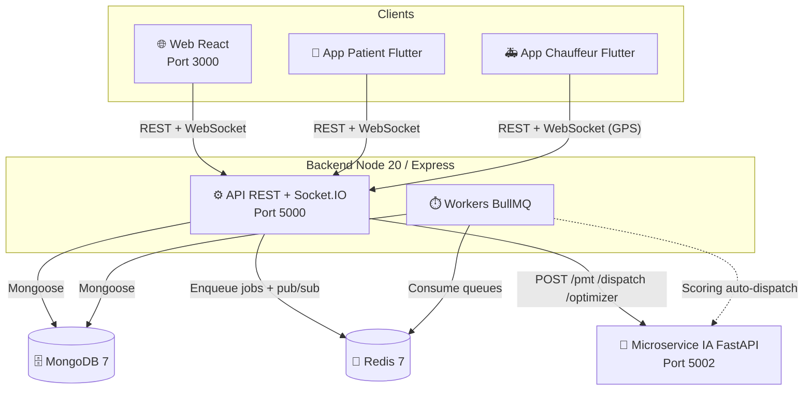

<div align="center">

# 🚑 Ambulances Blanc Bleu

### Plateforme de gestion du transport sanitaire non urgent

[](https://nodejs.org)
[](https://react.dev)
[](https://flutter.dev)
[](https://mongodb.com)
[](https://fastapi.tiangolo.com)
[](https://docker.com)
[](https://github.com/Mouinbhm/blancbleu/actions/workflows/ci.yml)
[](#-auteur)

> Système de dispatch, suivi GPS temps réel et assistance IA pour la gestion des transports médicaux — Nice, Alpes-Maritimes.
> Applications mobiles patient & chauffeur sur Android & iOS.

</div>

---

## Sommaire

- [Présentation](#-présentation)
- [Fonctionnalités](#-fonctionnalités)
- [Architecture](#-architecture)
- [Stack technique](#-stack-technique)
- [Prérequis](#-prérequis)
- [Installation](#-installation)
- [Application mobile (Flutter)](#-application-mobile-flutter)
- [Variables d'environnement](#-variables-denvironnement)
- [Premier démarrage](#-premier-démarrage)
- [Docker](#-docker)
- [Documentation API](#-documentation-api)
- [Structure du projet](#-structure-du-projet)
- [Tests](#-tests)
- [Conformité RGPD](#-conformité-rgpd)
- [Documentation opérationnelle](#-documentation-opérationnelle)
- [Auteur](#-auteur)

---

## 🎯 Présentation

**Ambulances Blanc Bleu** est une plateforme complète de gestion du transport sanitaire non urgent (VSL, TPMR, Ambulance) composée de quatre parties :

- **Application web** (React) — interface dispatcher/admin pour gérer le cycle de vie complet d'un transport : réservation, assignation de véhicule, suivi GPS temps réel, facturation
- **Application mobile patient** (Flutter) — réserver un transport, suivre son ambulance en direct, gérer ses prescriptions et consulter ses factures (Android & iOS)
- **Application mobile chauffeur** (Flutter) — recevoir les missions, accepter/refuser, émettre la position GPS temps réel, signature patient, mode offline-first pour les zones blanches
- **Microservice IA** (FastAPI / Python) — scoring de dispatch (système expert rule-based), prédicteur de durée (POC ML), extraction de PMT par OCR, optimisation de tournées (cf. [`ai-service/MODEL_CARD.md`](ai-service/MODEL_CARD.md) pour la posture officielle)

Les deux apps Flutter partagent un package commun **`bb_core`** (modèles typés, client réseau, push FCM, permissions, deep-links).

---

## ✨ Fonctionnalités

### Transport & Dispatch

- Création de transports avec géocodage automatique des adresses (BAN / data.gouv.fr)
- Machine d'état complète : `REQUESTED → CONFIRMED → SCHEDULED → ASSIGNED → EN_ROUTE → ARRIVED → ON_BOARD → AT_DESTINATION → COMPLETED → BILLED`
- Transports récurrents (dialyse, chimiothérapie, radiothérapie)
- Reprogrammation, annulation, no-show
- Simulation GPS temps réel (5 phases : dépôt → patient → hôpital)

### Gestion de flotte

- Suivi des véhicules (VSL, TPMR, Ambulance) en temps réel
- Carte interactive (Leaflet + OSRM routing)
- Historique de missions par véhicule

### Module IA (FastAPI)

- **Scoring de dispatch** — système expert pondéré (rule-based, 7 critères, 0 ML) : choix du véhicule sur la base de règles métier explicables. Le dispatcher reste l'autorité finale.
- **Prédicteur de durée** — POC ML (XGBoost) entraîné sur 1 500 transports **synthétiques**, 0 réels. Non destiné à la production tant que des données réelles ne sont pas collectées (cf. roadmap dans [`MODEL_CARD.md`](ai-service/MODEL_CARD.md)).
- **Extraction PMT par OCR** — Tesseract + regex + spaCy.
- **Optimisation de tournées** — Google OR-Tools (VRP).

### Gestion administrative

- Patients, prescriptions, personnel, équipements, maintenances
- Comptabilité & facturation
- Planning journalier et hebdomadaire

### Application mobile patient (Flutter)

- Réservation d'un transport depuis le smartphone (Android & iOS)
- Suivi GPS en temps réel de l'ambulance assignée (flutter_map)
- Consultation et dépôt de prescriptions médicales (PMT)
- Historique des transports et des factures
- Paiement en ligne via Stripe
- Authentification sécurisée avec persistance de session (shared_preferences)
- Notifications push FCM avec deep-links vers l'écran concerné
- Interface Material 3 adaptée aux patients

### Application mobile chauffeur (Flutter)

- Réception des missions assignées en temps réel (Socket.IO + push FCM critique)
- Acceptation / refus de mission, transitions de statut au fil de la course
- Émission de la position GPS en arrière-plan (isolate dédié)
- Signature du patient (preuve de prise en charge) et dépôt de PMT
- **Offline-first** : file d'actions persistée (Hive) rejouée au retour réseau — conçu pour les zones blanches (tunnels, parkings, montagne)
- Demandes de permission avec dialogues de justification (rationale) avant la popup système

### Système & Sécurité

- Authentification JWT avec refresh tokens (cookies httpOnly)
- Gestion des utilisateurs par l'admin : création, activation/désactivation, réinitialisation de mot de passe
- Email de bienvenue avec identifiants temporaires + changement forcé au premier login
- Audit log complet sur toutes les actions sensibles
- Rate limiting, protection XSS / NoSQL injection, Helmet CSP
- Notifications temps réel via Socket.IO
- Documentation API Swagger interactive

---

## 🏗️ Architecture

Documentation complète (3 diagrammes Mermaid — contexte, conteneurs, séquence) :
**[docs/architecture.md](docs/architecture.md)**.

### Vue conteneurs (C4 niveau 2)



---

## 🛠️ Stack technique

| Couche               | Technologies                                                                                                                  |
| -------------------- | ----------------------------------------------------------------------------------------------------------------------------- |
| **Web (Frontend)**   | React 19, React Router 7, Tailwind CSS 3, Leaflet, Chart.js, Socket.io-client                                                 |
| **Mobile**           | Flutter 3, Dart, flutter_map, flutter_stripe, Firebase Messaging (FCM), Hive (offline), connectivity_plus, permission_handler |
| **Backend**          | Node.js 20, Express 4, Socket.IO 4, Winston, Swagger UI                                                                       |
| **Base de données**  | MongoDB 7, Mongoose 8                                                                                                         |
| **Authentification** | JWT (access + refresh token), bcryptjs, cookies httpOnly                                                                      |
| **IA**               | FastAPI (Python), Tesseract OCR                                                                                               |
| **Cartographie**     | Leaflet, React-Leaflet, flutter_map, OSRM routing, BAN géocodage                                                              |
| **Paiement**         | Stripe (flutter_stripe)                                                                                                       |
| **Email**            | Nodemailer (SMTP)                                                                                                             |
| **Infrastructure**   | Docker, Docker Compose                                                                                                        |
| **Tests**            | Jest (backend), React Testing Library (frontend), flutter_test                                                                |

---

## 📋 Prérequis

**Web & Backend**

- **Node.js** ≥ 20.x · **npm** ≥ 9.x
- **MongoDB** (Atlas ou instance locale) — ou **Docker**
- **Python** ≥ 3.10 (microservice IA — optionnel)
- **Git**

**Application mobile**

- **Flutter SDK** ≥ 3.x ([installation](https://docs.flutter.dev/get-started/install))
- **Android Studio** ou **Xcode** (émulateur ou appareil physique)
- **Dart SDK** ≥ 3.2 (inclus dans Flutter)

---

## ⚙️ Installation

### 1. Cloner le dépôt

```bash
git clone https://github.com/Mouinbhm/blancbleu.git
cd blancbleu
```

### 2. Variables d'environnement

```bash
cp .env.example .env
# Éditer .env avec vos propres valeurs
```

### 3. Backend

```bash
cd server
npm install
npm run dev        # Développement avec rechargement automatique
```

### 4. Frontend

```bash
cd client
npm install
npm start          # http://localhost:3000
```

### 5. Microservice IA _(optionnel)_

```bash
cd ai-service
pip install -r requirements.txt
uvicorn main:app --host 0.0.0.0 --port 5002 --reload
```

---

## 📱 Application mobile (Flutter)

Deux applications Flutter indépendantes ciblant Android et iOS, partageant le
package commun `packages/bb_core` (modèles, réseau, push, permissions, deep-links) :

| Projet              | Cible                                      |
| ------------------- | ------------------------------------------ |
| `blancbleu_patient` | App patient (réservation, suivi, paiement) |
| `blancbleu_driver`  | App chauffeur (missions, GPS, offline)     |

### Installation

```bash
# App patient
cd blancbleu_patient
flutter pub get

# App chauffeur
cd ../blancbleu_driver
flutter pub get
```

### Lancer sur émulateur / appareil

```bash
# Lister les appareils disponibles
flutter devices

# Lancer en mode debug
flutter run

# Build Android (APK)
flutter build apk --release

# Build iOS
flutter build ios --release
```

### Configurer l'URL de l'API

Dans `lib/services/api_service.dart`, mettre à jour `baseUrl` avec l'adresse de votre serveur :

```dart
// Développement local (émulateur Android)
static const String baseUrl = 'http://10.0.2.2:5000/api';

// Développement local (appareil physique sur le même réseau)
static const String baseUrl = 'http://192.168.x.x:5000/api';

// Production
static const String baseUrl = 'https://api.blancbleu.fr/api';
```

### Écrans de l'app patient

| Écran                        | Description               |
| ---------------------------- | ------------------------- |
| `LoginScreen`                | Connexion patient         |
| `SignupScreen`               | Inscription               |
| `HomeScreen`                 | Tableau de bord patient   |
| `NouveauTransportScreen`     | Réserver un transport     |
| `TransportsScreen`           | Historique des transports |
| `TransportDetailScreen`      | Détail d'un transport     |
| `TrackingScreen`             | Suivi GPS temps réel      |
| `PrescriptionsScreen`        | Gestion des PMT           |
| `NouvellePrescriptionScreen` | Déposer une prescription  |
| `FacturesScreen`             | Factures & paiements      |
| `ProfileScreen`              | Profil utilisateur        |
| `NotificationsScreen`        | Notifications             |

---

## 🔐 Variables d'environnement

Copier `.env.example` en `.env` à la racine et renseigner toutes les valeurs :

```env
# MongoDB
MONGO_URI=mongodb+srv://<user>:<password>@cluster.mongodb.net/blancbleu

# JWT — générer avec :
# node -e "console.log(require('crypto').randomBytes(64).toString('hex'))"
JWT_SECRET=CHANGE_ME_GENERATE_A_STRONG_64_CHAR_SECRET

# Serveur
PORT=5000
NODE_ENV=development
CLIENT_URL=http://localhost:3000
ALLOWED_ORIGINS=http://localhost:3000

# Email (SMTP)
EMAIL_HOST=smtp.gmail.com
EMAIL_PORT=587
EMAIL_USER=votre-email@gmail.com
EMAIL_PASS=votre-app-password-gmail
EMAIL_FROM=BlancBleu <noreply@blancbleu.fr>

# Microservice IA
AI_API_URL=http://localhost:5002

# Routing OSRM (instance publique en développement)
OSRM_URL=https://router.project-osrm.org

# Premier administrateur (retirer après création)
ADMIN_EMAIL=admin@blancbleu.fr
ADMIN_PASSWORD=CHANGE_ME_STRONG_PASSWORD
ADMIN_NOM=Admin
ADMIN_PRENOM=BlancBleu
```

---

## 🚀 Premier démarrage

### Créer le premier compte administrateur

```bash
cd server
node scripts/create-admin.js
```

> Les comptes suivants sont créés **uniquement par un administrateur connecté** depuis la page `Utilisateurs → Nouvel utilisateur`. L'employé reçoit automatiquement ses identifiants par email et est forcé de changer son mot de passe à la première connexion.

### Données de démonstration _(développement uniquement)_

Pour peupler la base avec 6 transports et 6 véhicules de démonstration géolocalisés à Nice :

```bash
# Seeder les données
curl -X POST http://localhost:5000/api/demo/seed

# Réinitialiser
curl -X POST http://localhost:5000/api/demo/reset
```

> L'endpoint `/api/demo` est **automatiquement désactivé** en `NODE_ENV=production`.

---

## 🐳 Docker

Démarrer l'ensemble de la stack (MongoDB + Backend + IA + Frontend) en une seule commande :

```bash
# Construire et démarrer
docker-compose up --build

# En arrière-plan
docker-compose up -d --build

# Arrêter
docker-compose down

# Supprimer les volumes (remet la base à zéro)
docker-compose down -v
```

| Service               | URL                                                      |
| --------------------- | -------------------------------------------------------- |
| Frontend React        | http://localhost                                         |
| API REST              | http://localhost:5000/api                                |
| Documentation Swagger | http://localhost:5000/api-docs _(dev uniquement)_        |
| Microservice IA       | http://localhost:5002                                    |
| Health check          | http://localhost:5000/api/health                         |
| Métriques Prometheus  | http://localhost:5000/metrics (header `X-Metrics-Token`) |

### Démarrage en mode production

L'override `docker-compose.prod.yml` apporte : `restart: always`, rotation des logs
(json-file 10 MB × 3), limites de ressources (CPU/mémoire), `LOG_LEVEL=warn`.

```bash
docker compose -f docker-compose.yml -f docker-compose.prod.yml up -d --build
```

Voir [docs/operations.md](docs/operations.md) pour le runbook complet (backup, scaling, incident response).

---

## 📖 Documentation API

La documentation interactive **Swagger UI** (OpenAPI 3.0) est disponible à l'adresse :

```
http://localhost:5000/api-docs
```

> Active en développement uniquement. En production, elle reste désactivée sauf
> `SWAGGER_IN_PROD=true` (à protéger derrière une auth admin). Spec brute
> téléchargeable sur `/api-docs.json` ou régénérable via `npm --prefix server run docs:openapi`.
> Détails dans **[docs/api.md](docs/api.md)**.

### Principales routes

| Méthode | Endpoint                       | Description                | Accès  |
| ------- | ------------------------------ | -------------------------- | ------ |
| `POST`  | `/api/auth/login`              | Connexion                  | Public |
| `POST`  | `/api/auth/register`           | Créer un compte            | Admin  |
| `GET`   | `/api/auth/users`              | Lister les utilisateurs    | Admin  |
| `GET`   | `/api/transports`              | Lister les transports      | Privé  |
| `POST`  | `/api/transports`              | Créer un transport         | Privé  |
| `PATCH` | `/api/transports/:id/assign`   | Assigner un véhicule       | Privé  |
| `PATCH` | `/api/transports/:id/complete` | Compléter un transport     | Privé  |
| `GET`   | `/api/vehicles`                | Lister les véhicules       | Privé  |
| `GET`   | `/api/planning/daily`          | Planning du jour           | Privé  |
| `POST`  | `/api/ai/pmt/extract`          | Extraction PMT par OCR     | Privé  |
| `POST`  | `/api/ai/dispatch/:id`         | Recommandation de véhicule | Privé  |
| `GET`   | `/api/analytics/dashboard`     | Statistiques générales     | Privé  |
| `GET`   | `/api/health`                  | Health check               | Public |

---

## 📂 Structure du projet

```
blancbleu/
├── client/                        # Frontend React
│   ├── public/
│   └── src/
│       ├── components/
│       │   ├── layout/            # Sidebar, topbar, notifications
│       │   └── map/               # Carte Leaflet temps réel
│       ├── context/               # AuthContext (JWT + état global)
│       ├── hooks/                 # useSocket, ...
│       ├── pages/                 # Dashboard, Transports, Flotte, ...
│       └── services/              # api.js (Axios + tous les services)
│
├── server/                        # Backend Express
│   ├── controllers/               # Logique métier par domaine (transport/ éclaté)
│   ├── middleware/                # auth, rateLimiter, sanitize, swagger, ...
│   ├── models/                    # Schémas Mongoose (23 modèles)
│   ├── routes/                    # 27 routeurs REST
│   ├── services/                  # transportLifecycle, transportStateMachine,
│   │                              # tarifService, emailService, socketService
│   ├── docs/                      # openapi-components.js, openapi.json
│   ├── utils/                     # logger, geocodeUtils, healthCheck
│   ├── scripts/                   # create-admin.js, sync-indexes.js, ...
│   └── __tests__/                 # 30 suites Jest (unit + integration)
│
├── ai-service/                    # Microservice IA Python / FastAPI
│   ├── routers/                   # pmt, dispatch, routing
│   ├── MODEL_CARD.md              # Posture officielle des modèles
│   └── main.py
│
├── packages/bb_core/             # Package Flutter partagé (patient + chauffeur)
│   └── lib/src/                   # models, network, push (FCM + deep-links),
│                                  # permissions, storage, observability
│
├── blancbleu_patient/             # App mobile Flutter — patient
│   └── lib/                       # config, screens, services, widgets
│
├── blancbleu_driver/              # App mobile Flutter — chauffeur
│   └── lib/                       # core (offline, network), features
│                                  # (tournee, shift, transport, chat)
│
├── client/                        # Frontend React (cf. arbre ci-dessus)
├── docs/                          # Architecture, RGPD, API, sécurité, ops, ...
├── e2e/                           # Tests end-to-end Playwright
├── .env.example                   # Template des variables d'environnement
├── docker-compose.yml             # Orchestration complète
└── README.md
```

---

## 🧪 Tests

```bash
# Backend — Jest
cd server
npm test                    # Tous les tests
npm run test:coverage       # Rapport de couverture de code

# Frontend — React Testing Library
cd client
npm test

# Mobile — Flutter
cd blancbleu_patient
flutter test                # Tests unitaires et widgets

# E2E Playwright (nécessite stack démarrée — voir e2e/README.md)
npm run test:e2e
```

---

## 🔒 Conformité RGPD

La plateforme traite des **données de santé** (catégorie particulière,
art. 9 RGPD). Le cadrage de conformité est documenté dans 3 fichiers
complémentaires :

| Document                                                     | Contenu                                                                                                  |
| ------------------------------------------------------------ | -------------------------------------------------------------------------------------------------------- |
| [docs/rgpd.md](docs/rgpd.md)                                 | Cadrage opérationnel : bases légales, durées de conservation, droits des personnes, sous-traitants, HDS. |
| [docs/dpia.md](docs/dpia.md)                                 | Analyse d'impact (DPIA / AIPD) v1.0 — description du traitement, risques, mitigations, droits.           |
| [docs/registre-traitements.md](docs/registre-traitements.md) | Registre des activités de traitement (art. 30) — 7 fiches.                                               |

**Statut** : version POC — **non hébergée HDS**, **aucune donnée patient
réelle**. La bascule vers un Hébergeur de Données de Santé agréé est
obligatoire avant ouverture à des patients réels — cf. `docs/rgpd.md` §13.

Endpoints RGPD implémentés (extrait) : `GET /api/gdpr/export` (droit
d'accès + portabilité), `DELETE /api/gdpr/me` (effacement self-service),
`POST /api/gdpr/patients/:id/anonymize` (anonymisation admin avec
confirmReason obligatoire, 7 tests d'intégration).

---

## 📚 Documentation opérationnelle

| Document                                                       | Contenu                                                               |
| -------------------------------------------------------------- | --------------------------------------------------------------------- |
| [docs/architecture.md](docs/architecture.md)                   | 3 diagrammes Mermaid : contexte, conteneurs, séquence                 |
| [docs/api.md](docs/api.md)                                     | Guide Swagger / OpenAPI : accès, auth, régénération de la spec        |
| [docs/operations.md](docs/operations.md)                       | Déploiement prod, sauvegardes, monitoring, scaling, runbook incidents |
| [docs/security.md](docs/security.md)                           | Auth, secrets, audit, dépendances, divulgation responsable            |
| [docs/mobile-security.md](docs/mobile-security.md)             | Sécurité apps Flutter (pinning, secure storage, logger no-op, Sentry) |
| [docs/a11y.md](docs/a11y.md)                                   | Accessibilité web : règles jsx-a11y, conventions, audit               |
| [docs/socket-events.md](docs/socket-events.md)                 | Catalogue des événements Socket.IO temps réel                         |
| [docs/ia-dispatch-scoring.md](docs/ia-dispatch-scoring.md)     | Algorithme de scoring dispatch                                        |
| [docs/ia-duration-predictor.md](docs/ia-duration-predictor.md) | Modèle de prédiction de durée                                         |
| [docs/ocr-benchmark.md](docs/ocr-benchmark.md)                 | Benchmark OCR PMT                                                     |

---

## 👤 Auteur

**Mouin Ben Hadj Mohamed**
Projet de Fin d'Études (PFE) — Développement web full-stack
Nice, France · 2026

---

<div align="center">
  <sub>Ambulances Blanc Bleu · 59 Boulevard Madeleine, Nice · 04 93 00 00 00</sub>
</div>
