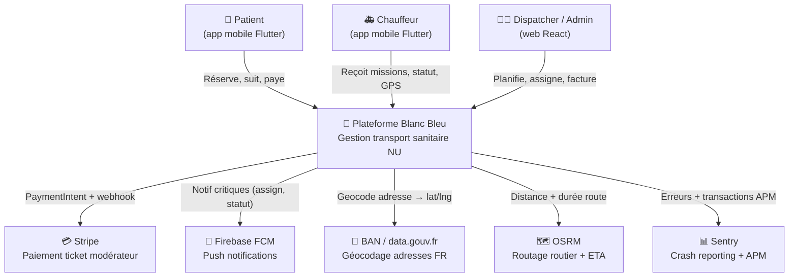
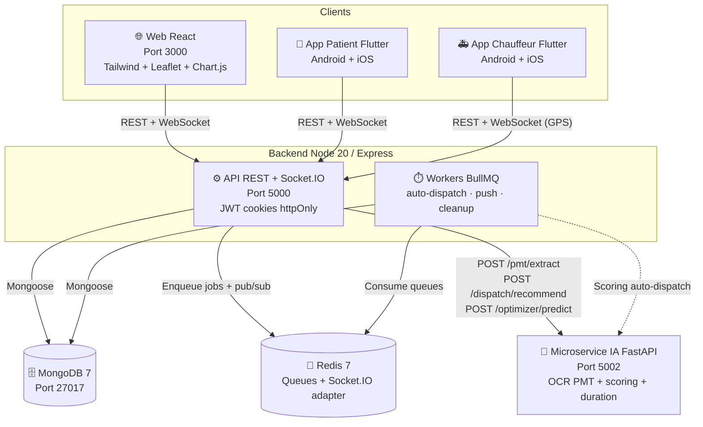

# Architecture — Ambulances Blanc Bleu

Vue d'ensemble de la plateforme de transport sanitaire non urgent.
3 diagrammes pour 3 niveaux de zoom : contexte (qui parle au système), conteneurs
(de quoi il est fait), séquence (comment ça se passe pour un transport).

Tous les diagrammes utilisent [Mermaid](https://mermaid.live) — rendu natif sur
GitHub. Pour un aperçu local : extension _Markdown Preview Mermaid Support_ sous
VSCode.

---

## 1. Contexte (C4 niveau 1)

Acteurs humains + systèmes externes connectés à la plateforme.

**Lecture rapide**

- 3 types d'utilisateurs : **patient** (réservation + suivi), **chauffeur**
  (réception missions + GPS), **dispatcher/admin** (planning + facturation).
- 5 systèmes externes : **paiement** (Stripe), **push** (FCM), **géocodage**
  (BAN), **routage** (OSRM), **observabilité** (Sentry).
- Tous les appels sortants sont **optionnels par dégradation gracieuse** — si
  FCM ou Stripe sont indisponibles, les opérations critiques continuent
  (assignation transport, calcul tarif, etc.).

---

## 2. Conteneurs (C4 niveau 2)

Décomposition runtime : 3 frontends, 1 backend (API + workers + Socket.IO),
1 microservice IA, 2 data stores.

**Lecture rapide**

- Un **seul backend** Express qui sert à la fois l'API REST, le serveur
  Socket.IO et les workers BullMQ (worker BullMQ peut tourner dans le même
  process ou un process séparé via `node server/workers/start.js`).
- **Redis joue 2 rôles** : broker BullMQ + adapter Socket.IO multi-instance
  (pour scaling horizontal du serveur Express).
- Le **microservice IA est sans état** — il ne touche pas à MongoDB. Il reçoit
  des payloads et renvoie des recommandations / prédictions. Le backend Node
  reste autorité sur les données métier.
- Les **3 clients** parlent au backend en HTTP (REST) + WebSocket
  (Socket.IO). Les apps mobiles utilisent les cookies httpOnly en plus de
  l'Authorization header (refresh single-flight, cf. `docs/security.md`).

---

## 3. Séquence — Cycle de vie d'un transport

Scénario complet : un patient réserve, l'IA propose un véhicule, un dispatcher
valide, le chauffeur exécute, la facturation se déclenche.

```mermaid
sequenceDiagram
    autonumber
    actor P as 📱 Patient
    participant API as ⚙️ API Express
    participant DB as 🗄️ MongoDB
    participant W as ⏱️ Worker BullMQ
    participant IA as 🤖 Service IA
    actor D as 🧑‍💼 Dispatcher
    actor C as 🚑 Chauffeur

    P->>API: POST /api/patient/transports (réservation)
    API->>DB: insert Transport(statut=REQUESTED)
    API->>W: enqueue auto-dispatch job
    API-->>P: 201 Created (numero TRS-...)

    W->>IA: POST /dispatch/recommend
    IA-->>W: best vehicule + score
    W->>DB: save DispatchRecommendation
    W->>API: emit "autoDispatch:proposal_decided" (Socket.IO)
    API-->>D: WebSocket → badge file de validation

    D->>API: POST /api/transports/:id/assigner
    API->>DB: atomic claim Vehicle + update Transport(statut=ASSIGNED)
    API-->>D: 200 OK
    API->>C: FCM push "Nouvelle mission" (canal critique)
    API-->>P: WebSocket "transport:status_updated" (statut=ASSIGNED)

    C->>API: PATCH statut=EN_ROUTE_TO_PICKUP
    loop GPS toutes les 5s
        C->>API: emit "driver:location" (Socket.IO)
        API-->>P: emit "vehicle:position" (room patient)
    end

    C->>API: PATCH statut=COMPLETED + signature patient
    API->>DB: update Transport + libère Vehicle(statut=Disponible)
    API->>W: enqueue billing job
    W->>DB: insert Facture(montant CPAM + ticket modérateur)
    W->>API: emit "facture:updated"
    API-->>P: FCM "Facture disponible"

    P->>API: POST /api/payments/intent (Stripe)
    API->>API: stripe.paymentIntents.create()
    API-->>P: clientSecret
    Note over P,API: Stripe webhook payment_intent.succeeded<br/>→ Facture statut=payee
```

**Lecture rapide**

- **Étapes 1-4** : réservation immédiate (REQUESTED). Pas de blocage UI sur
  l'IA — le job auto-dispatch est asynchrone via BullMQ.
- **Étapes 5-8** : l'IA propose, le dispatcher valide (human-in-the-loop). Le
  dispatcher peut refuser ; le transport repart en file SCHEDULED pour
  assignation manuelle.
- **Étapes 9-13** : l'assignation est **atomique** côté Mongo (cf. refactor
  concurrence — `Vehicle.findOneAndUpdate` avec garde `statut=Disponible`).
  Push FCM canal critique pour notifier le chauffeur même app tuée.
- **Étapes 14-18** : tracking GPS en temps réel via Socket.IO. Le patient
  voit son véhicule arriver sur la carte.
- **Étapes 19-25** : facturation déclenchée par le passage en COMPLETED via
  BullMQ. PaymentIntent Stripe créé à la demande du patient ; statut final
  confirmé par webhook (jamais côté client).

---

## Limites volontaires des diagrammes

- **Pas de niveau C4 composant** (niveau 3) — les controllers/services internes
  ne sont pas dépeints ici. Voir le code et `docs/socket-events.md`.
- **Pas de diagramme déploiement** — Docker Compose est documenté dans
  `docker-compose.yml` et `docs/operations.md`.
- **Une seule séquence** sur les ~15 flux métier (annulation, no-show,
  reprogrammation, reroll IA, refus chauffeur…). Le cycle de vie complet de la
  state machine est dans `server/services/transportStateMachine.js`.
